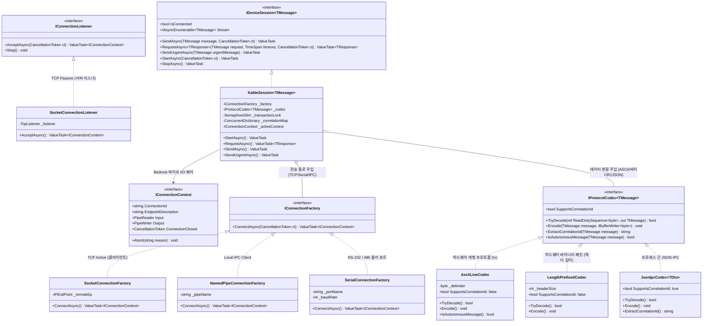

# 01. Architecture Overview (아키텍처 개요)

> 본 문서는 LIMS 차세대 통합 통신 프레임워크의 핵심 설계 철학, 3단 계층 구조, 클래스 다이어그램을 정의합니다.

---

## 1. 아키텍처 핵심 철학: "Bedrock Transport + RSocket Interaction"

```
┌─────────────────────────────────────────────────────────────────────────────┐
│ 1. 상위 계층: RSocket 스타일 상호작용 API (IDeviceSession<T>)              │
│    • RequestAsync<TRes>(req, timeout)  : 요청-응답 (Correlation ID + 워치독) │
│    • SendAsync(msg)                    : 단방향 통지 (Fire-and-Forget)      │
│    • Stream (IAsyncEnumerable<T>)      : 실시간 계측 데이터 스트림 구독      │
│    • SendUrgentAsync(msg)              : 비상 E-STOP OOB(Out-of-band) 송신  │
├─────────────────────────────────────────────────────────────────────────────┤
│ 2. 중간 계층: 양방향 프로토콜 코덱 (IProtocolCodec<T>)                      │
│    • 프레이밍(개행 \n, STX/ETX, 길이헤더) + 직렬화(ASCII, 바이너리, JSON)    │
│    • System.IO.Pipelines 기반 Zero-Allocation 버퍼 슬라이싱                 │
├─────────────────────────────────────────────────────────────────────────────┤
│ 3. 하위 계층: Bedrock 표준 전송 추상화 (IConnectionContext)                │
│    • PipeReader Input / PipeWriter Output                                   │
│    • Socket(TCP Active/Passive), Serial(RS-232/485), NamedPipe(IPC) 플러그인 │
└─────────────────────────────────────────────────────────────────────────────┘
```

### 1.1 하부: Bedrock 전송 추상화 (Pipelines / ConnectionContext)
- TCP 소켓, COM 포트 시리얼, Windows NamedPipe IPC 등 물리 매체에 상관없이 **"읽는 파이프(`Input`)와 쓰는 파이프(`Output`)를 가진 단일 연결(`IConnectionContext`)"**으로 완벽히 수렴합니다.
- `System.IO.Pipelines`를 기반으로 바이트 복사 없는 0-할당(Zero-Allocation) I/O를 수행하여 가비지 컬렉터(GC) 압박을 90% 이상 제거합니다.

### 1.2 상부: RSocket 스타일 상호작용 API (`IDeviceSession<T>`)
- 상대방이 원격 하드웨어(ICP-MS, PLC)든 동일 PC 내 외부 프로그램(MassHunter)이든 상위 LIMS 제어기가 수행하는 핵심 통신 행위는 동일합니다:
  1. **`RequestAsync`**: 명령 전송 후 정해진 타임아웃 내 응답 대기 (하이브리드 라우팅 + 소프트웨어 워치독 격리)
  2. **`SendAsync`**: 단방향 알림/명령 전송 (Fire-and-Forget)
  3. **`Stream`**: 실시간 계측 데이터 연속 수신 (`IAsyncEnumerable<T>`)
  4. **`SendUrgentAsync`**: 일반 큐를 우회하는 긴급 비상 정지(E-STOP) OOB 주입

### 1.3 [핵심 혁신] 하이브리드 트랜잭션 라우터 & Fail-Fast 단선 안전 정책
- **동일 장비 내 동시성 보호 (하이브리드 선점형 FIFO 락)**:
  - **식별자가 없는 단문 ASCII/시리얼 장비**: 다중 스레드(모니터링 루프 + 사용자 조작)가 동시 호출 시, 엔진 내부에서 `SemaphoreSlim(1, 1)` 기반 선점형 FIFO 락이 자동 작동하여 앞선 명령의 응답이 수신될 때까지 다음 명령을 안전하게 대기열에 줄 세웁니다. (응답 뒤섞임 위험 0%)
  - **식별자(Correlation ID)를 지원하는 고속 IPC/모던 장비**: 락을 우회하여 `ConcurrentDictionary` 기반의 고속 병렬 인터리빙(Pipelining)으로 처리합니다.
  - **자발적 계측/알람 우회**: 요청 대기 중 장비가 스스로 발행한 텔레메트리(`IsAutonomousMessage == true`)가 들어오면, 이를 요청 응답으로 오인하지 않고 `Stream` 채널로 자동 분기합니다.
- **Fail-Fast 단선 안전 정책**:
  - 케이블 탈락 등 단선 발생 시, 대기 중인 모든 요청은 지연 재전송(Hold & Replay) 없이 **즉시 `DeviceDisconnectedException`을 발생**시켜 상위 LIMS 제어기가 하드웨어 안전 정지(Safe-State) 및 경보를 즉각 취하도록 합니다. (인적/물적 사고 원천 차단)

---

## 2. 통합 아키텍처 클래스 다이어그램 (Class Diagram)


