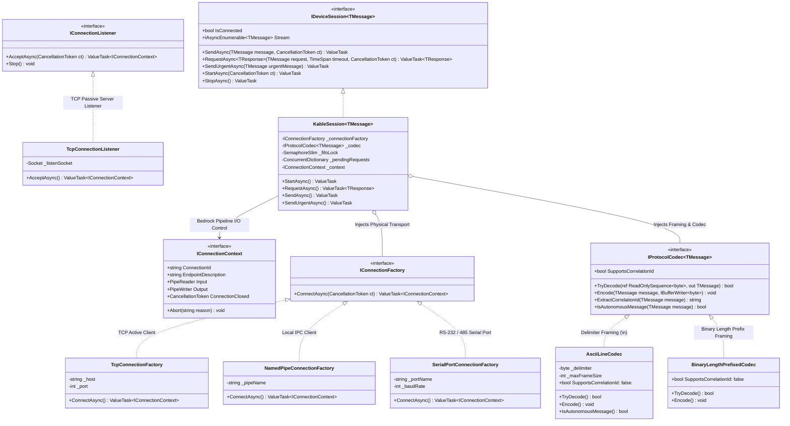

# 01. Architecture Overview

> This document defines the core design philosophy, 3-tier layer structure, and class diagrams of the `Kable` unified reactive communication framework.

---

## 1. Core Architectural Philosophy: "Bedrock Transport + RSocket Interaction"

```
┌─────────────────────────────────────────────────────────────────────────────┐
│ 1. Upper Layer: RSocket-Style Reactive Interaction API (IDeviceSession<T>)  │
│    • RequestAsync<TRes>(req, timeout)  : Request-Response (Correlation + WD)│
│    • SendAsync(msg)                    : One-Way Notification (Fire-Forget) │
│    • Stream (IAsyncEnumerable<T>)      : Real-Time Telemetry Stream Ingestion│
│    • SendUrgentAsync(msg)              : Out-Of-Band (OOB) Emergency E-STOP │
├─────────────────────────────────────────────────────────────────────────────┤
│ 2. Middle Layer: Bidirectional Protocol Codec (IProtocolCodec<T>)           │
│    • Framing (\n, STX/ETX, Length Prefix) + Serialization (ASCII, Bin, JSON)│
│    • Zero-Allocation Buffer Slicing via System.IO.Pipelines & ReadOnlySeq   │
├─────────────────────────────────────────────────────────────────────────────┤
│ 3. Lower Layer: Bedrock Standard Transport Abstraction (IConnectionContext) │
│    • PipeReader Input / PipeWriter Output                                   │
│    • Socket (TCP Active/Passive), Serial (RS-232/485), NamedPipe (IPC)      │
└─────────────────────────────────────────────────────────────────────────────┘
```

### 1.1 Lower: Bedrock Transport Abstraction (`Pipelines` / `ConnectionContext`)
- Unifies all physical communication mediums (TCP sockets, COM ports, Windows NamedPipes) into a single abstraction: **"A single connection context (`IConnectionContext`) possessing an `Input` reader pipe and an `Output` writer pipe"**.
- Built on `System.IO.Pipelines` to perform zero-allocation I/O without copying buffers, eliminating over 90% of Garbage Collector (GC) pressure.

### 1.2 Upper: RSocket-Style Interaction API (`IDeviceSession<T>`)
- Regardless of whether the peer is remote laboratory hardware (ICP-MS, PLC) or a local process (MassHunter, ChemStation), interaction semantics are unified into 4 patterns:
  1. **`RequestAsync`**: Transmit request and await response within a specified timeout (hybrid transaction routing with watchdog isolation).
  2. **`SendAsync`**: One-way asynchronous notification or command (fire-and-forget).
  3. **`Stream`**: Ingest continuous real-time measurement telemetry (`IAsyncEnumerable<T>`).
  4. **`SendUrgentAsync`**: Out-of-band (OOB) transmission that bypasses queued transactions to trigger immediate emergency stops (E-STOP).

### 1.3 [Key Innovation] Hybrid Transaction Router & Fail-Fast Safety Policy
- **In-Flight Concurrency Protection (Hybrid Preemptive FIFO Lock)**:
  - **Uncorrelated ASCII / Serial Instruments**: When multiple threads (e.g. periodic polling loop + manual UI commands) dispatch requests concurrently, an internal `SemaphoreSlim(1, 1)` FIFO lock serializes transmissions until previous responses arrive, eliminating response mismatch risks.
  - **Correlated Modern Protocols / IPC**: Bypasses FIFO locks to enable lock-free parallel interleaving and pipelining via an internal correlation registry.
  - **Spontaneous Alarm / Telemetry Routing**: Unsolicited telemetry packets arriving during request execution (`IsAutonomousMessage == true`) are diverted to the `Stream` channel rather than polluting pending request completion.
- **Fail-Fast Disconnection Safety**:
  - Upon link severance or cable detachment, all awaiting requests fail immediately with `DeviceDisconnectedException` without dangerous blind retransmission retries, enabling immediate safe-state transitions for hardware.

---

## 2. Integrated Architecture Class Diagram


