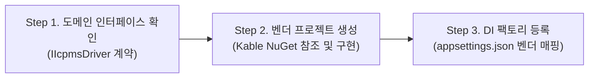

# 01. Multi-Vendor Extension Strategy (다중 벤더 확장 전략)

> 본 문서는 Smart LIMS에 새로운 계측 장비(예: 신규 벤더 ICP-MS, 크로마토그래피, pH 측정기 등)가 추가될 때 기존 LIMS 코드를 단 1줄도 수정하지 않고, **독립 배포된 `Kable` NuGet 패키지를 기반으로 플러그인 모듈을 무한 확장**하는 표준 절차를 정의합니다.

---

## 1. 3단계 표준 확장 절차 (The 3-Step Extension Pipeline)



### [Step 1] 도메인 공통 인터페이스 확인
- 상위 LIMS 코어는 장비 브랜드(Agilent, PerkinElmer, Thermo)를 알지 못하며, 오직 도메인 계약인 **`IIcpmsDriver`**에만 의존합니다.
- 신규 장비는 이 인터페이스의 규격(`IgnitePlasmaAsync`, `StartBatchAsync`, `AbortBatchAsync`, `GetBatchStatusAsync`, `GetPlasmaStateAsync`)을 구현해야 합니다.

### [Step 2] 벤더별 독립 프로젝트 생성 및 `Kable` NuGet 장착
- `src/Icpms.{VendorName}/` 형태의 프로젝트를 생성하고, 독립 배포된 `Kable` NuGet 패키지를 참조합니다:
  ```xml
  <PackageReference Include="Kable" Version="1.0.0" />
  ```
- 모듈 내부 구성:
  1. `Protocol/`: 해당 벤더 특유의 명령/패킷 레코드 (`[DeviceCommand]`, `[SpontaneousEvent]`, 또는 `[DeviceRpcContract]`)
  2. `Codec/`: `Kable.Generators`가 컴파일 타임에 0-할당 코덱(`IProtocolCodec<T>`)을 자동 생성
  3. `Driver/`: `IIcpmsDriver`를 구현하며, `KableSession` 엔진을 통해 비즈니스 흐름을 오케스트레이션
  4. `Extensions/`: `Add{Vendor}DeviceDriver(...)` DI 등록 확장 메서드 제공

### [Step 3] DI 팩토리 및 설정(Config) 바인딩
- `appsettings.json`에서 분석 라인별 장비 벤더와 연결 파라미터를 동적으로 구성합니다:
  ```json
  {
    "IcpmsConfig": {
      "LineA": { "Vendor": "Agilent", "Port": "COM3", "BaudRate": 9600 },
      "LineB": { "Vendor": "PerkinElmer", "Host": "192.168.1.120", "Port": 50051 }
    }
  }
  ```
- LIMS 시작 시 팩토리 패턴(`IcpmsDriverFactory`)이 설정값을 읽어 적절한 벤더 모듈을 인스턴스화하고 LIMS 코어에 주입합니다.

---

## 2. 벤더별 통신 구조 비교 (Agilent vs PerkinElmer)

| 비교 항목 | Agilent MassHunter (7900/8900) | PerkinElmer NexION (Syngistix) |
| :--- | :--- | :--- |
| **프로젝트 명** | `src/Icpms.MassHunter` | `src/Icpms.PerkinElmer` |
| **통신 기반** | `Kable` NuGet 패키지 참조 | `Kable` NuGet 패키지 참조 |
| **물리/논리 전송선** | RS-232C Serial COM 포트 (`SerialConnectionContext`) | TCP Socket / gRPC IPC (`SocketConnectionContext`) |
| **프레이밍 방식** | CR (`\r`, 0x0D) 개행 가변 길이 프레이밍 | Length-Prefixed 바이너리 또는 HTTP/2 gRPC 프레이밍 |
| **동시성 모델** | 번호표 없음 $\rightarrow$ **선점형 FIFO 락 활성화** | 요청별 RPC 매핑 $\rightarrow$ **고속 병렬 인터리빙 지원** |
| **결과 수신 방식** | 계측 종료 시 `$FileName,...` 자발적 텍스트 통지 | `GetAcquisitionResult(n)` 폴링 또는 gRPC 스트림 |
| **플라즈마 제어** | `oPON\r` / `oPOFF\r` | `StartPlasma` / `StopPlasma` |
| **배치/시퀀스** | `oBATCH.script\r` + `oAPPEND10\r` | `LoadMethod` + `StartAcquisition` + `PumpStart` |
