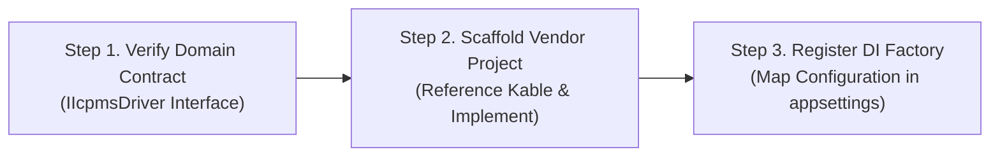

# 01. Multi-Vendor Extension Strategy

> This document defines the standard procedure for onboarding new analytical hardware (e.g., ICP-MS, Gas Chromatographs, pH meters) without modifying existing host code, leveraging **standalone `Kable` NuGet package consumption**.

---

## 1. The 3-Step Extension Pipeline



### [Step 1] Verify Domain Common Contract
- Host applications do not bind directly to vendor brands (Agilent, PerkinElmer, Thermo), depending exclusively on the domain interface **`IIcpmsDriver`**:
  - `IgnitePlasmaAsync()`, `ExtinguishPlasmaAsync()`
  - `StartBatchAsync()`, `AbortBatchAsync()`
  - `GetBatchStatusAsync()`, `GetPlasmaStateAsync()`

### [Step 2] Scaffold Vendor-Specific Project & Install `Kable`
- Create an isolated project (e.g., `src/Icpms.{VendorName}/`) and add the `Kable` NuGet package reference:
  ```xml
  <PackageReference Include="Kable" Version="1.1.0" />
  ```
- Standard sub-module structure:
  1. `Protocol/`: Wire packet records (`[DeviceCommand]`, `[SpontaneousEvent]`, `[DeviceRpcContract]`).
  2. `Codec/`: Zero-allocation framing (`IProtocolCodec<T>`).
  3. `Driver/`: `IIcpmsDriver` implementation orchestrating business flows over `IDeviceSession<T>`.
  4. `Extensions/`: `Add{Vendor}DeviceDriver(...)` DI registration extensions.

### [Step 3] Bind Configuration & Factory Injection
- Configure per-line connection parameters in `appsettings.json`:
  ```json
  {
    "IcpmsConfig": {
      "LineA": { "Vendor": "Agilent", "Port": "COM3", "BaudRate": 9600 },
      "LineB": { "Vendor": "PerkinElmer", "Host": "192.168.1.120", "Port": 50051 }
    }
  }
  ```
- An `IcpmsDriverFactory` instantiates the matching vendor driver at startup and injects it into the host application.

---

## 2. Multi-Vendor Architecture Comparison (Agilent vs. PerkinElmer)

| Category | Agilent MassHunter (7900/8900) | PerkinElmer NexION (Syngistix) |
| :--- | :--- | :--- |
| **Project Name** | `src/Icpms.MassHunter` | `src/Icpms.PerkinElmer` |
| **Foundation** | `Kable` NuGet Package | `Kable` NuGet Package |
| **Transport Medium** | RS-232C Serial COM Port (`SerialPortConnectionContext`) | TCP Socket / NamedPipe (`TcpConnectionContext` / `NamedPipeConnectionContext`) |
| **Framing Method** | CR (`\r`, 0x0D) delimiter framing | Length-prefixed binary or gRPC RPC framing |
| **Concurrency Model** | No correlation token $\rightarrow$ **Preemptive FIFO Lock** | Request-correlated tokens $\rightarrow$ **Lock-free Pipelining** |
| **Result Ingestion** | Spontaneous `$FileName,...` completion event | `GetAcquisitionResult(n)` polling or stream |
| **Plasma Control** | `oPON\r` / `oPOFF\r` | `StartPlasma` / `StopPlasma` |
| **Batch Sequences** | `oBATCH.script\r` + `oAPPEND10\r` | `LoadMethod` + `StartAcquisition` + `PumpStart` |
