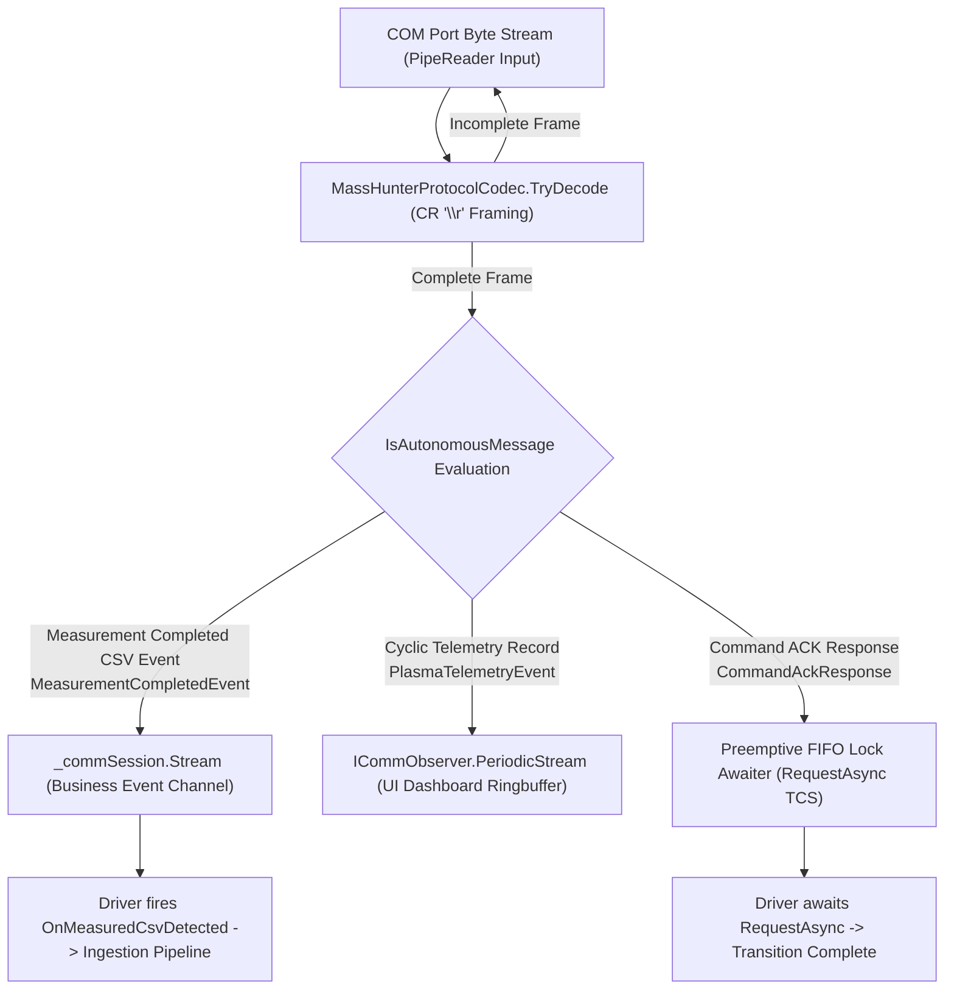
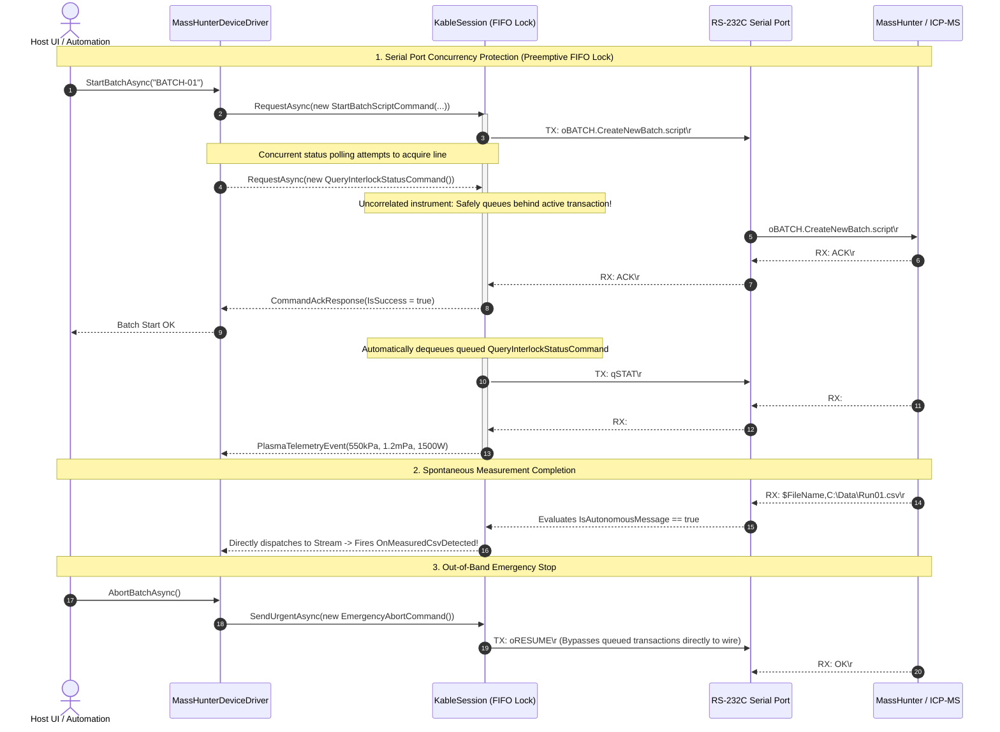

# 03. Agilent Architecture & Design

> This document defines the module layout, class diagrams, data flowcharts, and interaction timing models for the Agilent MassHunter ICP-MS driver module.

---

## 1. Modular Project Layout

Packaged as an isolated project (`src/Icpms.MassHunter`), maintaining file sizes strictly under 300 lines in compliance with `CONVENTIONS.md`:

```
src/Icpms.MassHunter/                        # [Driver Module Root]
│
├── Icpms.MassHunter.csproj                  # .NET 10 Class Library
│
├── Protocol/                                # [Protocol Layer: Icpms.MassHunter.Protocol]
│   ├── MassHunterCommands.cs                # [DeviceCommand] Outbound command declarations
│   ├── MassHunterPackets.cs                 # Inbound packet records and event models
│   └── MassHunterProtocolCodec.cs           # Zero-allocation delimiter framing codec
│
├── Driver/                                  # [Domain Driver: Icpms.MassHunter]
│   ├── IIcpmsDriver.cs                      # Unified domain business contract
│   ├── MassHunterDeviceDriver.cs            # FSM state control & stream orchestration
│   └── MassHunterDriverOptions.cs           # Serial port options model
│
└── Extensions/                              # [IoC Registration]
    └── MassHunterServiceExtensions.cs       # AddMassHunterDeviceDriver DI extension
```

---

## 2. Class Diagram


---

## 3. Data Flowchart



---

## 4. Interaction Timing Diagram


