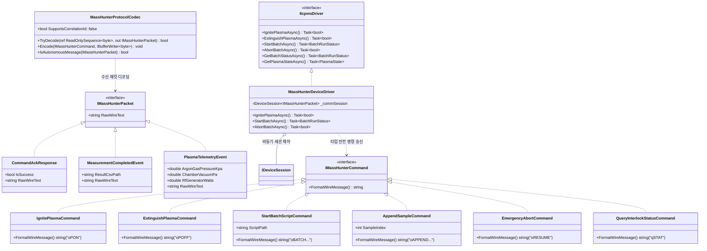
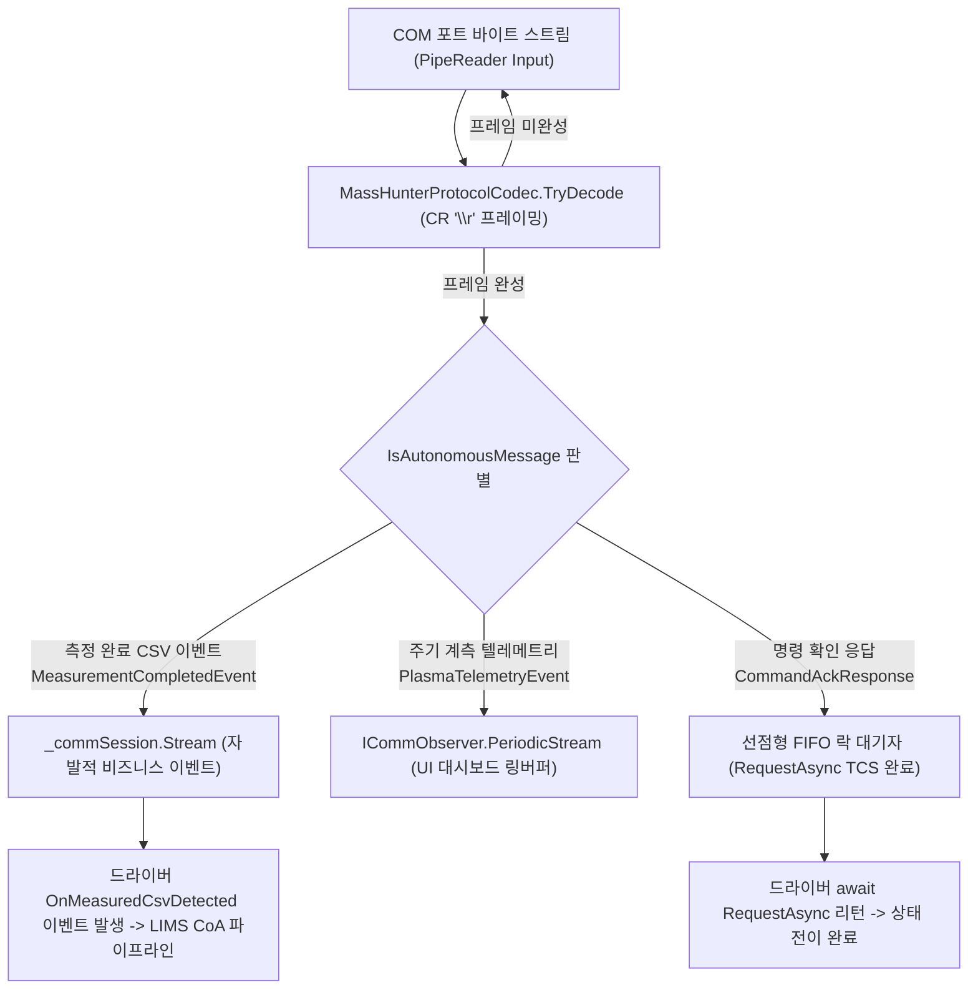
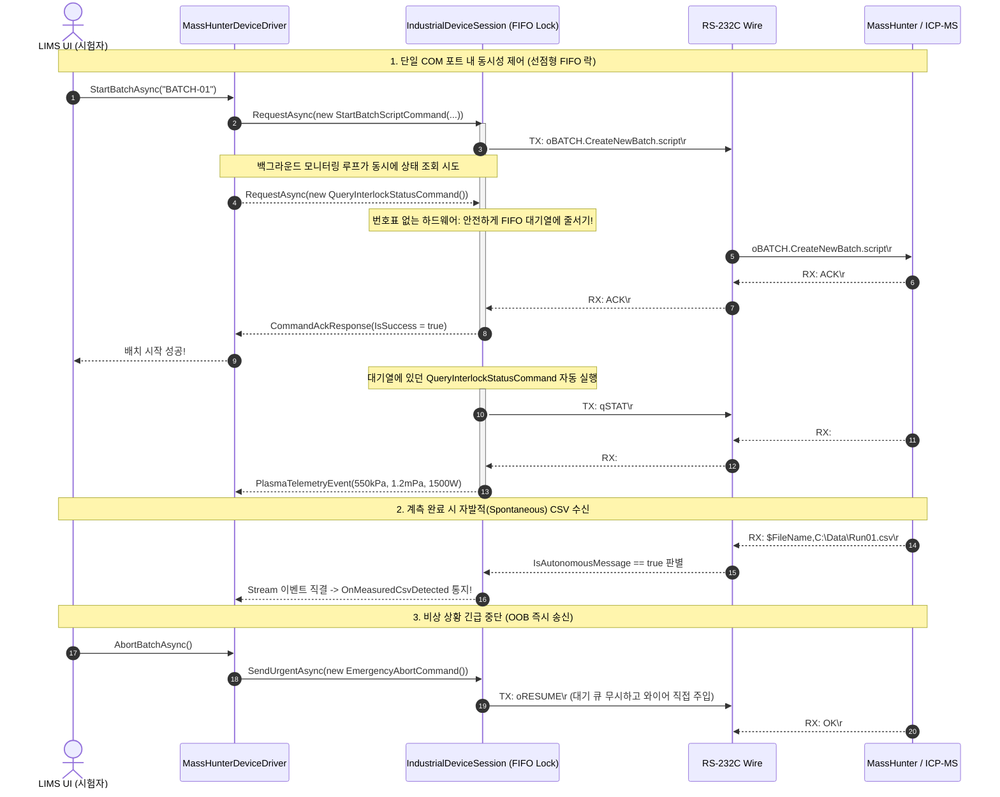

# 03. Agilent Architecture & Design (애질런트 아키텍처 및 설계)

> 본 문서는 Agilent MassHunter 드라이버 모듈의 디렉터리 구성표, 클래스 다이어그램, 데이터 흐름도 및 타이밍 차트를 정의합니다.

---

## 1. 독립 모듈 디렉터리 레이아웃 (Module Project Layout)

본 드라이버는 다른 장비와 섞이지 않는 **독립 프로젝트 모듈(`Icpms.MassHunter`)**로 패키징되며, `CONVENTIONS.md`에 의거하여 **단일 파일 300줄 이내**로 완벽히 분리됩니다:

```
src/Icpms.MassHunter/                        # [루트 프로젝트 모듈]
│
├── Icpms.MassHunter.csproj                  # .NET 10 클래스 라이브러리
│
├── Protocol/                                # [프로토콜 레이어: 네임스페이스 Icpms.MassHunter.Protocol]
│   ├── MassHunterCommands.cs                # [DeviceCommand] 초간결 송신 명령 선언
│   ├── MassHunterPackets.cs                 # [SpontaneousEvent] 수신 패킷 & 이벤트 모델
│   └── MassHunterProtocolCodec.g.cs         # 컴파일 타임 자동 생성된 0-할당 코덱
│
├── Driver/                                  # [비즈니스 드라이버: 네임스페이스 Icpms.MassHunter]
│   ├── IIcpmsDriver.cs                      # LIMS 공통 비즈니스 인터페이스 계약
│   ├── MassHunterDeviceDriver.cs            # FSM 상태 제어, 워치독 격리 및 스트림 디스패처
│   └── MassHunterDriverOptions.cs           # 포트명, 보드레이트, 기본 타임아웃 옵션 모델
│
└── Extensions/                              # [IoC 등록: 네임스페이스 Microsoft.Extensions.DependencyInjection]
    └── MassHunterServiceExtensions.cs       # AddMassHunterDeviceDriver 확장 메서드
```


---

## 2. 클래스 다이어그램 (Class Diagram)



---

## 3. 데이터 흐름도 (Data Flowchart)



---

## 4. 상호작용 타이밍 차트 (Timing Diagram)


