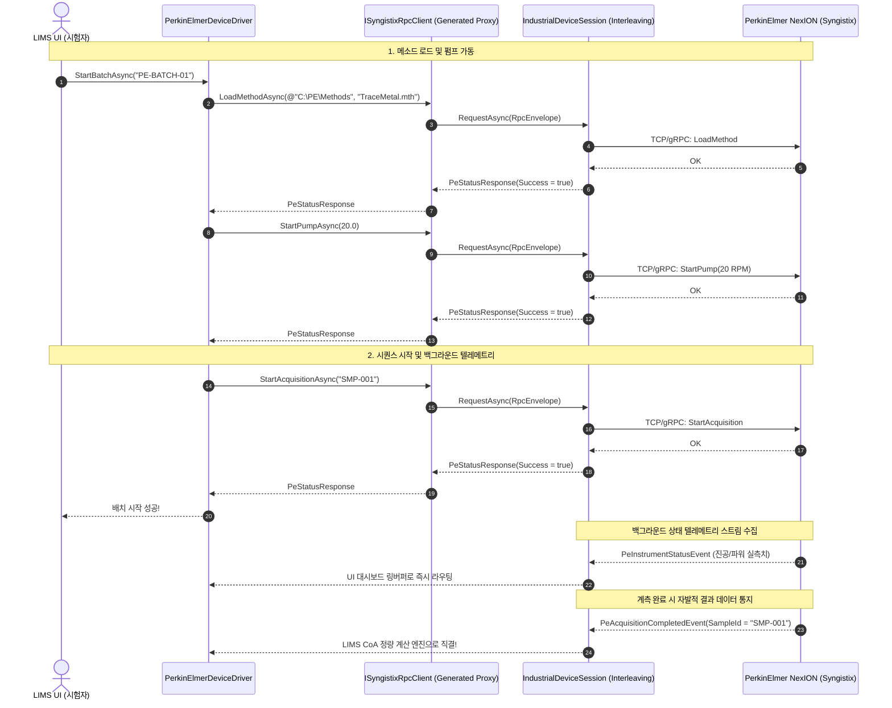

# 05. PerkinElmer Syngistix Case Study (퍼킨엘머 실전 연동 사양서)

> 본 문서는 `D:\Johnny\00.Project\06.SBID\01.Source\02.Library\06.ICP_MS`의 `RemoteSyngistix.cs` 실무 소스코드를 역설계하여, PerkinElmer NexION ICP-MS(Syngistix 소프트웨어 원격 제어)를 차세대 프레임워크로 통합하는 사양서입니다.

---

## 1. 퍼킨엘머 Syngistix 통신 특성 분석

- **연결 매체**: 고속 TCP/IP 네트워크 소켓 또는 gRPC 통신
- **통신 철학**:
  - 메소드 파일(`LoadMethod`)을 원격 소프트웨어에 로드한 후,
  - 펌프 가동(`StartPump`), 세틀링 타임 대기(`MethodSettleTime`),
  - 샘플 ID를 지정하여 시퀀스를 시작(`StartAcquisition`)하고,
  - 주기적인 상태 감시(`GetInstrumentStatusAsync`) 및 결과 취득(`GetAcquisitionResult`)을 수행합니다.

---

## 2. 송수신 데이터 및 RPC 명세표

| 구분 | 기능 명칭 | 원천 API 매핑 (`RemoteSyngistix`) | 방향 | 트래픽 종류 (`TrafficKind`) | 설명 |
| :--- | :--- | :--- | :---: | :---: | :--- |
| **TX** | **플라즈마 점등** | `m_Client.StartPlasma()` | LIMS $\rightarrow$ PE | `AperiodicCommand` | 플라즈마 고주파 점등 RPC 호출 |
| **TX** | **플라즈마 소등** | `m_Client.StopPlasma()` | LIMS $\rightarrow$ PE | `AperiodicCommand` | 플라즈마 소등 RPC 호출 |
| **TX** | **메소드 로드** | `m_Client.LoadMethod(folder, name)` | LIMS $\rightarrow$ PE | `AperiodicCommand` | 지정된 분석 메소드(.mth) 원격 로드 |
| **TX** | **펌프 속도 제어** | `m_Client.StartPump(dSpeedRPM)` | LIMS $\rightarrow$ PE | `AperiodicCommand` | 시료 주입 연동 펌프 RPM 구동 |
| **TX** | **펌프 정지** | `m_Client.StopPump()` | LIMS $\rightarrow$ PE | `AperiodicCommand` | 시료 주입 펌프 정지 |
| **TX** | **분석 시퀀스 시작**| `m_Client.StartAcquisition(sampleId)` | LIMS $\rightarrow$ PE | `AperiodicCommand` | 지정 시료 검체 분석 개시 |
| **TX** | **분석 긴급 중단** | `m_Client.StopAcquisition()` | LIMS $\rightarrow$ PE | `AperiodicCommand` | 분석 시퀀스 비상 정지 |
| **TX/RX**| **상태 주기 폴링** | `m_Client.GetInstrumentStatusAsync()`| 양방향 | `PeriodicTelemetry` | 온도, 압력, 인터록 상태 시계열 수집 |
| **RX** | **계측 결과 스트림**| `m_Client.AcquisitionResultEvent` | PE $\rightarrow$ LIMS | `SpontaneousAlarm` | 원소별 CPS/농도 계측 완료 알림 이벤트 |

---

## 3. 클래스 다이어그램 (Class Architecture)

---

## 4. 상호작용 타이밍 차트 (Sequence Diagram)

