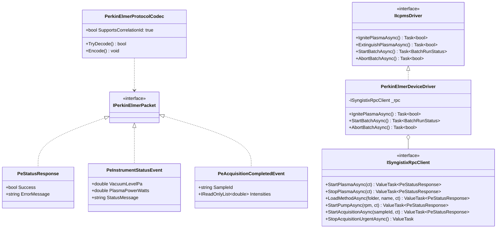
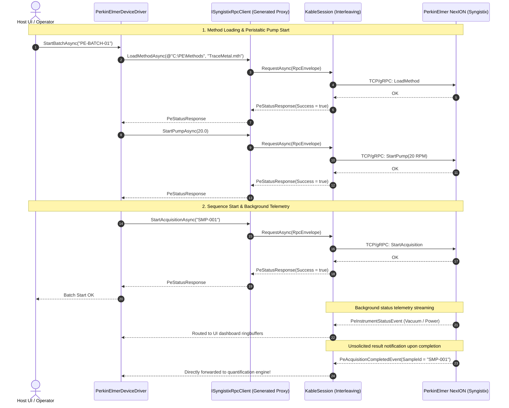

# 05. PerkinElmer Syngistix Case Study

> This document specifies the integration architecture for PerkinElmer NexION ICP-MS instruments (Syngistix software remote automation) using `Kable`.

---

## 1. PerkinElmer Syngistix Protocol Characteristics

- **Transport Medium**: High-speed TCP/IP network socket or local gRPC NamedPipe
- **Interaction Model**:
  - Remote method loading (`LoadMethod`).
  - Peristaltic pump speed regulation (`StartPump`), settling delay (`MethodSettleTime`).
  - Sample acquisition triggering (`StartAcquisition`).
  - Continuous status polling (`GetInstrumentStatusAsync`) and acquisition result ingestion (`GetAcquisitionResult`).

---

## 2. Protocol & RPC Operation Specification

| Direction | Operation | Source API Mapping | Traffic Kind | Description |
| :---: | :--- | :--- | :---: | :--- |
| **TX** | **Ignite Plasma** | `m_Client.StartPlasma()` | `AperiodicCommand` | RF plasma ignition RPC call |
| **TX** | **Extinguish Plasma** | `m_Client.StopPlasma()` | `AperiodicCommand` | RF plasma extinguishing RPC call |
| **TX** | **Load Method** | `m_Client.LoadMethod(folder, name)` | `AperiodicCommand` | Loads `.mth` analytical method template |
| **TX** | **Start Pump** | `m_Client.StartPump(dSpeedRPM)` | `AperiodicCommand` | Activates peristaltic pump at specified RPM |
| **TX** | **Stop Pump** | `m_Client.StopPump()` | `AperiodicCommand` | Stops sample delivery pump |
| **TX** | **Start Acquisition** | `m_Client.StartAcquisition(sampleId)` | `AperiodicCommand` | Starts measurement sequence for sample |
| **TX** | **Stop Acquisition** | `m_Client.StopAcquisition()` | `AperiodicCommand` | Emergency sequence termination |
| **TX/RX** | **Poll Status** | `m_Client.GetInstrumentStatusAsync()` | `PeriodicTelemetry` | Queries vacuum, RF power, and interlocks |
| **RX** | **Acquisition Stream** | `m_Client.AcquisitionResultEvent` | `SpontaneousAlarm` | Measurement completion CPS and intensity event |

---

## 3. Class Architecture

---

## 4. Sequence Diagram

