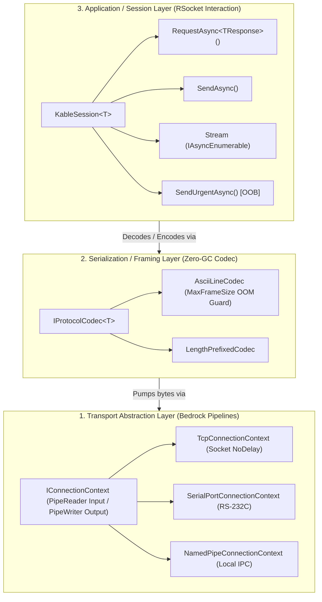

# 🔌 Kable - Project Specification (SSOT)

> **Document Status**: Single Source of Truth (SSOT)  
> **Last Updated**: 2026-09-04  
> **Target Platforms**: C# .NET 10 (C# 13), .NET 8.0 (LTS), .NET Standard 2.0  
> **Related Documents**: [SYSTEM_DESIGN.md](file:///d:/Johnny/Kable/docs/SYSTEM_DESIGN.md), [CONVENTIONS.md](file:///d:/Johnny/Kable/docs/CONVENTIONS.md), [INDEX.md](file:///d:/Johnny/Kable/docs/INDEX.md)

---

## 1. Mission & Architectural Purpose

`Kable` completely eliminates legacy technical debt (thread blocking, memory fragmentation, interleaved response pollution, and UI freezing) found in conventional industrial communication libraries. It integrates **Microsoft Bedrock's transport abstraction (`System.IO.Pipelines` / `IConnectionContext`)** with **RSocket's reactive interaction model (`RequestAsync` / `SendAsync` / `Stream` / `SendUrgentAsync`)** to deliver a high-performance, zero-allocation reactive hardware communication engine.

### 4 Core Architectural Decisions
1. **Hybrid Transaction Routing**:
   - Legacy ASCII instruments without correlation tokens: Automatically serialized via an asynchronous preemptive FIFO lock (`SemaphoreSlim(1, 1)`), preventing response mismatch.
   - Modern protocols with Correlation IDs: Lock-free high-throughput pipelining and interleaved multiplexing.
2. **Fail-Fast Disconnection Safety Policy**:
   - Immediate dispatch of `DeviceDisconnectedException` upon cable detachment or link termination, driving physical instruments into a guaranteed safe state without unsafe delayed retries.
3. **Strict Separation of Concerns**:
   - Core Engine (`Kable`): Emits pure 0-GC packet trace events (`OnPacketTrace`) with zero file I/O or disk logging overhead.
   - Logging & UI Presentation: Handled asynchronously by external loggers and bounded UI ringbuffers (`ChannelReader`, `DropOldest`), completely preventing UI lagging.
4. **Pure Multi-Targeting**:
   - Native cross-compilation for `.NET 10.0`, `.NET 8.0 (LTS)`, and `.NET Standard 2.0` (supporting .NET Framework 4.8 and legacy edge systems).

---

## 2. 3-Tier Layered Architecture Topology



---

## 3. Solution Structure

```
d:/Johnny/Kable/
├── Kable.sln                     # Kable Master Solution
├── AGENTS.md                     # [SSOT] AI Agent Workspace Governance Rules
├── CONTRIBUTING.md               # [SSOT] Development Guidelines & PR Rules
├── CHANGELOG.md                  # [SSOT] Semantic Versioning Release Notes
├── README.md                     # Library Overview & Fluent Quick-Start
├── docs/                         # Technical Specifications & Architecture Docs
│   ├── PROJECT_SPEC.md           # [SSOT] Project Mission & Architectural Decisions
│   ├── SYSTEM_DESIGN.md          # [SSOT] Interface Specifications & Flow Diagrams
│   ├── CONVENTIONS.md            # [SSOT] Coding Standards & Strict Rules
│   ├── INDEX.md                  # Comprehensive Documentation Index
│   ├── 01_ARCHITECTURE_OVERVIEW.md
│   ├── 02_CORE_INTERFACES.md
│   ├── 03_OBSERVABILITY_LOGGING.md
│   ├── 04_IMPLEMENTATION_LAYOUT.md
│   ├── 05_ICP_MS_CASE_STUDY/
│   └── qa_test_engineering/     # QA Master Plan & Test Specifications
├── src/
│   ├── Kable/                    # Core Library (Transports, Codecs, Engine, Observability)
│   └── Kable.Generators/         # Roslyn Incremental Source Generator
└── tests/
    ├── Kable.Tests/              # Runtime Unit & Fault-Injection Tests (92 Tests)
    └── Kable.Generators.Tests/   # Source Generator Isolation Tests (4 Tests)
```
