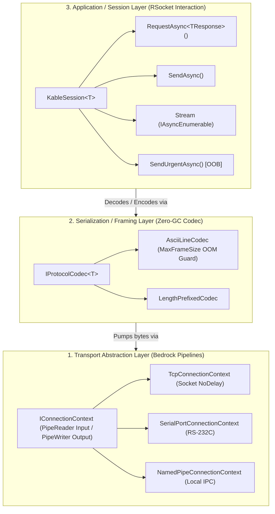

# 🔌 Kable - Project Specification (SSOT)

> **문서 상태**: 단일 진실 공급원 (Single Source of Truth)  
> **최종 갱신**: 2026-09-04  
> **대상 플랫폼**: C# .NET 10 (C# 13), .NET 8.0 (LTS), .NET Standard 2.0  
> **관련 문서**: [SYSTEM_DESIGN.md](file:///d:/Johnny/Kable/docs/SYSTEM_DESIGN.md), [CONVENTIONS.md](file:///d:/Johnny/Kable/docs/CONVENTIONS.md), [INDEX.md](file:///d:/Johnny/Kable/docs/INDEX.md)

---

## 1. 프로젝트 목적 (Mission & Purpose)

`Kable`은 레거시 산업용 통신 라이브러리의 기술 부채(스레드 블로킹, 메모리 누수, 응답 뒤섞임, UI 프리징)를 완전 청산하고, **Microsoft Bedrock의 전송 추상화(`System.IO.Pipelines` / `IConnectionContext`)**와 **RSocket의 상호작용 패턴(`RequestAsync` / `SendAsync` / `Stream` / `SendUrgentAsync`)**을 결합한 차세대 고성능 제로-할당 하드웨어 통신 엔진입니다.

### 핵심 설계 4대 확정 원칙
1. **하이브리드 트랜잭션 라우팅 (Hybrid Transaction Routing)**:
   - 번호표(Correlation ID)가 없는 레거시 단문 ASCII 장비: 내부 비동기 선점형 FIFO 락(`SemaphoreSlim(1, 1)`)으로 응답 뒤섞임 원천 차단.
   - 번호표를 지원하는 고속 IPC/모던 프로토콜: 락 없이 고속 병렬 인터리빙(Pipelining) 지원.
2. **Fail-Fast 단선 안전 정책 (Fail-Fast Disconnection Safety)**:
   - 케이블 탈락 및 단선 감지 시 대기 중인 모든 명령은 즉시 `DeviceDisconnectedException`을 발생시켜 장비의 안전 정지(Safe-State) 유도.
3. **철저한 관심사의 분리 (Separation of Concerns)**:
   - 통신 엔진(`Kable`): 순수 0-GC 관측성 통지(`OnPacketTrace`)만 발행.
   - 로깅 및 UI 표출: 주입된 로거와 UI 링버퍼(`ChannelReader`, DropOldest)가 독립적으로 비동기 처리하여 UI 렉 방지.
4. **순수 크로스 플랫폼 및 멀티 타기팅 (Pure Multi-Targeting)**:
   - `.NET 10.0`, `.NET 8.0 (LTS)` 및 `.NET Standard 2.0` (.NET Framework 4.8 레거시 환경 포함) 전면 지원.

---

## 2. 3단 계층 아키텍처 토폴로지 (3-Tier Layered Architecture)



---

## 3. 솔루션 프로젝트 구성 (Solution Structure)

```
d:/Johnny/Kable/
├── Kable.sln                     # Kable 메인 솔루션 파일
├── AGENTS.md                     # [SSOT] AI 개발 에이전트 최상위 준수 규칙
├── CONTRIBUTING.md               # [SSOT] 기여 및 개발 가이드라인
├── CHANGELOG.md                  # [SSOT] 버전별 변경 이력
├── README.md                     # 메인 안내 및 Fluent Quick-Start
├── docs/                         # 상세 기술 및 설계 문서군
│   ├── PROJECT_SPEC.md           # [SSOT] 프로젝트 상세 스펙
│   ├── SYSTEM_DESIGN.md          # [SSOT] 시스템 설계 및 코어 인터페이스 규격
│   ├── CONVENTIONS.md            # [SSOT] 코딩 규칙, 모듈 격리, 엄격 금지 규칙
│   ├── INDEX.md                  # 전체 아키텍처 및 상세 사양서 종합 색인
│   ├── 01_ARCHITECTURE_OVERVIEW.md
│   ├── 02_CORE_INTERFACES.md
│   ├── 03_OBSERVABILITY_LOGGING.md
│   ├── 04_IMPLEMENTATION_LAYOUT.md
│   ├── 05_ICP_MS_CASE_STUDY/
│   └── qa_test_engineering/     # QA 테스트 엔지니어링 마스터 플랜
├── src/
│   ├── Kable/                    # Kable 메인 라이브러리 (Transports, Codecs, Engine, Observability)
│   └── Kable.Generators/         # Roslyn Incremental Source Generator
└── tests/
    └── Kable.Tests/              # 96개 단위/결함 주입/동시성 통합 테스트 스위트
```
