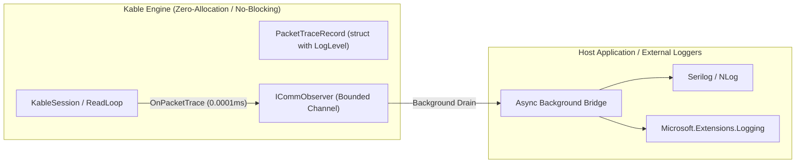

# 06. Observability & Log Level Engineering Test Specification

> **Target Components**: `Kable.Core`, `Kable.Observability`, `Kable.Engine`  
> **Key Contracts**: `LogLevel`, `PacketTraceRecord`, `ICommObserver`  
> **Target Audience**: World-Class Test & QA Engineers, Protocol Reliability Architects  
> **Related Design**: [03_OBSERVABILITY_LOGGING.md](file:///d:/Johnny/Kable/docs/03_OBSERVABILITY_LOGGING.md)

---

## 1. 개요 및 엔지니어링 배경 (Executive Summary)

하드웨어 통신 엔진(`Kable`)에서 발생하는 통신 로그와 예외를 무분별하게 문자열로 남기거나 예외를 단순히 삼켜버리는(`catch { }`) 관행은 **실제 현장 장애 분석을 불가능하게 만들고, 모니터링 알람 시스템을 무력화**합니다.
또한, 외부 로깅 라이브러리(`Serilog`, `ILogger` 등)를 코어 엔진 내부에서 직접 호출하면 디스크 I/O 락이나 문자열 박싱/할당으로 인해 **Kable의 핵심 가치인 0-GC 및 초고속 비동기 파이프라인이 훼손**됩니다.

이에 따라 Kable은 **"코어 완전 무의존(Zero-Dependency) + LogLevel 정형화 + 0-GC 비동기 채널 격리"** 아키텍처를 확립하였습니다.

---

## 2. LogLevel 표준 매트릭스 (Severity Matrix)

Kable의 모든 패킷 추적 및 엔진 상태 변화는 `LogLevel` 열거형으로 엄격히 분류되어 `PacketTraceRecord` 구조체로 전달됩니다.

```csharp
namespace Kable.Observability;

public enum LogLevel
{
    Trace = 0,       // 저수준 바이트 스트림 파편화, 1바이트 윈도우 조립
    Debug = 1,       // 정상 요청/응답 왕복, SendAsync, Correlation ID 매칭
    Information = 2, // 세션 시작/종료, 소켓 및 시리얼 연결 수립/우아한 종료
    Warning = 3,     // 단일 요청 타임아웃, 지연된 유령(Phantom) 응답 수신 격리
    Error = 4,       // I/O 루프 중단, 소켓 리셋(RST), 스트림 단선, 코덱 파싱 크래시
    Critical = 5     // 긴급 명령(E-STOP) FIFO 즉시 우회 전송, OOM 가드 초과
}
```

---

## 3. 핵심 설계: 외부 로거와의 "완전 격리 브릿지 (Decoupled Bridge)"



### 3대 안전 원칙
1. **Zero-Allocation**: `PacketTraceRecord`는 `readonly struct`로 스택에 생성되어 힙 할당이 전혀 발생하지 않습니다.
2. **Zero-Blocking**: `ICommObserver.OnPacketTrace`는 `Channel.TryWrite()`를 통해 수 마이크로초 이내에 반환되므로, 디스크 쓰기 지연이 물리 통신 루프를 멈추지 않습니다.
3. **No-Dependency**: `Kable.Core`는 서드파티 로깅 라이브러리에 종속되지 않으므로, .NET 버전 간 어셈블리 충돌이 원천 방지됩니다.

---

## 4. 자동화 테스트 완료 현황 (Verified Test Suite)

신규 LogLevel 및 예외 수집 기능에 대해 다음 테스트가 작성되어 100% 정상 통과(`Pass`)되었습니다:

| 테스트 ID | 테스트 메서드명 | 검증 내용 | 상태 |
| :--- | :--- | :--- | :---: |
| `TC_OBS_102` | `TC_OBS_102_KableSession_LogLevelClassification_EmitsDebugForCommands_AndCriticalForUrgent` | `SendAsync` 호출 시 `LogLevel.Debug`, `SendUrgentAsync` 호출 시 `LogLevel.Critical` 발행 검증 | **Pass** |
| `TC_OBS_103` | `TC_OBS_103_KableSession_TimeoutAndStreamCrash_EmitsWarningAndErrorLogLevels` | 요청 타임아웃 시 `LogLevel.Warning`, 수신 파이프 스트림 강제 크래시 시 `LogLevel.Error` 발행 검증 | **Pass** |
| `TC_OBS_104` | `TC_OBS_104_KableSession_DispatchLoopException_LogsErrorAndDoesNotHangEngine` | 디스패치 루프 내 예외 발생 시 `LogLevel.Error` 발행 및 엔진 무음 정지(Hang) 방지 검증 | **Pass** |

---

## 5. 테스트 엔지니어 전달: 추가 검증 필요 시나리오 (Recommended Test Scenarios)

세계 최고의 테스트 엔지니어가 후속으로 보강해야 할 고난도 관측성 테스트 시나리오는 다음과 같습니다:

### 📌 TC_OBS_201: ObserverBufferFull_DropOldest_PreservesErrorAndCriticalLevels
- **목적**: 초고주파 텔레메트리가 대량 발생하여 `ICommObserver` 버퍼가 포화 상태일 때, `LogLevel.Error` 또는 `Critical` 레벨의 중요 알람 패킷이 유실되지 않는지(또는 알람 채널이 분리 보장되는지) 검증.
- **실행 절차**:
  1. 버퍼 용량 10인 `CommObserver` 구성.
  2. 100건의 `LogLevel.Debug` 텔레메트리 주입 후, 1건의 `LogLevel.Critical` 긴급 패킷 주입.
  3. `AlarmStream`을 통해 `Critical` 패킷이 즉시 드레인되는지 검증.

### 📌 TC_OBS_202: ZeroGC_PacketTraceRecord_AllocationBenchmark
- **목적**: 100만 건의 `PacketTraceRecord`를 `OnPacketTrace`로 발행했을 때 GC Gen0/Gen1/Gen2 컬렉션이 발생하지 않는지 BenchmarkDotNet 기반 메모리 프로파일링 검증.

### 📌 TC_OBS_203: SwallowedExceptions_AbortCancellation_DoesNotEmitFalseErrors
- **목적**: 정상적인 세션 중단(`StopAsync` / `DisposeAsync`) 시 발생하는 `OperationCanceledException`이나 소켓 닫기는 정상 흐름이므로 `LogLevel.Error`로 오인 발행되지 않고, 오직 실제 비정상 하드웨어 단선 시에만 `LogLevel.Error`가 발행되는지 신호 대 잡음비(SNR) 검증.
