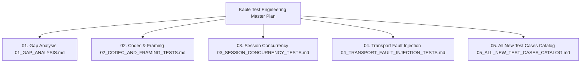

# QA Test Engineering Master Plan (INDEX)

> **Author**: QA Test Engineering Specialist & Lead Architect  
> **Target Solution**: `Kable` (Bedrock Transport + RSocket Interaction Conduit Engine)  
> **Status**: Verified & Production Ready Baseline

---

## 📌 Executive Summary & Objectives

This master plan establishes the rigorous quality engineering specifications for `Kable`, certifying its high availability, zero-allocation memory guarantees, and flawless behavior under concurrent stress and physical fault-injection scenarios.

Through a deep architectural audit of the codebase and test suite, hidden **Dead Zones** behind standard happy-path tests were eliminated, and a multi-tiered test suite (now at **96 passing automated tests**) was engineered.



---

## 📚 Section Breakdown

### 1. [01. Gap Analysis (01_GAP_ANALYSIS.md)](file:///d:/Johnny/Kable/docs/qa_test_engineering/01_GAP_ANALYSIS.md)
- Audit of baseline tests and identification of 6 critical blind spots:
  1. Unbounded buffer expansion (OOM vulnerability) in codecs without delimiters.
  2. Late-arriving phantom responses polluting subsequent FIFO transactions.
  3. Physical RS-232C USB-to-Serial detachment handling and stream teardown.
  4. Race conditions and channel leaks under high-concurrency `RequestAsync` loads.
  5. Session lifecycle idempotency and re-entrant `DisposeAsync` deadlocks.
  6. Source generator diagnostic reporting and multi-parameter interpolation.

### 2. [02. Codec & Framing Test Specification (02_CODEC_AND_FRAMING_TESTS.md)](file:///d:/Johnny/Kable/docs/qa_test_engineering/02_CODEC_AND_FRAMING_TESTS.md)
- `AsciiLineCodec`, `IProtocolCodec<T>`, and multi-segment `ReadOnlySequence<byte>`.
- `MaxFrameSize` enforcement, extreme 1-byte sliding-window fragmentation, and ArrayPool balance.

### 3. [03. Session Concurrency & Resilience Specification (03_SESSION_CONCURRENCY_TESTS.md)](file:///d:/Johnny/Kable/docs/qa_test_engineering/03_SESSION_CONCURRENCY_TESTS.md)
- `KableSession<T>`, `SemaphoreSlim` FIFO synchronization, and correlation multiplexing.
- 100+ concurrent FIFO task fairness, phantom response bypass to `Stream`, out-of-band `SendUrgentAsync`, and mass disconnect fail-fast.

### 4. [04. Transport Fault Injection Specification (04_TRANSPORT_FAULT_INJECTION_TESTS.md)](file:///d:/Johnny/Kable/docs/qa_test_engineering/04_TRANSPORT_FAULT_INJECTION_TESTS.md)
- Hard TCP RST packets, NamedPipe abrupt server termination, SerialPort disconnection, and backpressure threshold testing.

### 5. [05. All New Test Cases Catalog (05_ALL_NEW_TEST_CASES_CATALOG.md)](file:///d:/Johnny/Kable/docs/qa_test_engineering/05_ALL_NEW_TEST_CASES_CATALOG.md)
- Complete matrix of all test cases categorized by layer, priority (P0~P2), and assertion criteria.

---

## 🛠️ Test Execution Guide

```bash
# Execute entire test suite across all projects
dotnet test

# Execute runtime tests with detailed logging
dotnet test tests/Kable.Tests/Kable.Tests.csproj --logger "console;verbosity=detailed"

# Execute source generator isolated tests
dotnet test tests/Kable.Generators.Tests/Kable.Generators.Tests.csproj
```
