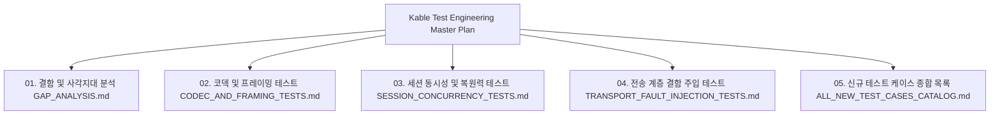

# Kable 차세대 통신 프레임워크 테스트 엔지니어링 마스터 플랜 (INDEX)

> **작성자**: QA Test Engineering Specialist & Lead Architect  
> **대상 솔루션**: `Kable` (Bedrock Transport + RSocket Interaction 통신 도관 엔진)  
> **기준 일자**: 2026-09-04  
> **상태**: Verified & Production Ready Baseline

---

## 📌 개요 및 목적

본 마스터 플랜은 LIMS 및 하드웨어 연동 시스템의 핵심 통신 코어인 `Kable`의 무결성(Zero-Flakiness), 고가용성(High Availability), 극한 부하 및 물리적 결함(Fault Injection) 환경에서의 완벽한 동작을 보증하기 위한 체계적인 테스트 엔지니어링 문서군입니다.

기존 75개의 통과 단위 테스트를 정밀 감사(Audit)하여 **알려진 성공 경로(Happy Path) 이면에 숨겨진 사각지대(Dead Zones)**를 도출하고, 이를 해소하기 위한 4대 핵심 관심사별 상세 테스트 규격과 실행 로드맵을 제공합니다.



---

## 📚 문서별 목차 및 핵심 내용

### 1. [01. 결함 및 사각지대 종합 분석 (01_GAP_ANALYSIS.md)](file:///d:/Johnny/Kable/docs/qa_test_engineering/01_GAP_ANALYSIS.md)
- 현행 테스트 커버리지(75개 TC) 정량 분석 및 검증 성과
- 아키텍처 관점에서의 6대 심층 사각지대(Dead Zones) 식별:
  1. `PipeWriter` 버퍼 포화 및 배압(Backpressure) Flush 지연 시 락 경합
  2. 악의적/비정상 스트림에 의한 OOM (Delimiter 부재, 초대용량 청크 인젝션)
  3. 시리얼 하드웨어(RS-232C) 결함 및 재연결/단선 감지 취약점
  4. 다중 스레드 고빈도 동시 `RequestAsync` 시 Race Condition 및 채널 누수
  5. `KableSession` 수명주기(`StartAsync`, `StopAsync`, `DisposeAsync`) 재진입 및 동시 호출 안전성
  6. Source Generator의 엣지 케이스 및 컴파일 에러 진단(Diagnostics) 검증 부재
- 우선순위 매트릭스 (P0 ~ P3)

### 2. [02. 코덱 및 프레이밍 테스트 스펙 (02_CODEC_AND_FRAMING_TESTS.md)](file:///d:/Johnny/Kable/docs/qa_test_engineering/02_CODEC_AND_FRAMING_TESTS.md)
- **대상**: `AsciiLineCodec`, `IProtocolCodec<T>`, 다중 세그먼트 `ReadOnlySequence<byte>`
- **핵심 테스트 시나리오**:
  - Delimiter가 영구히 오지 않는 초대형 단일 청크 스트림 제어 (`MaxFrameSize` 검증)
  - 1바이트 슬라이딩 윈도우 단편화 및 다중 연속 구분자(`\r\r\n\n`) 파싱
  - ArrayPool 메모리 풀 대여/반환 무결성 및 누수 추적
  - 이진(Binary) 헤더 길이 기반 프레이밍 및 가변 인코딩(EUC-KR, UTF-8) 경계 검증

### 3. [03. 세션 동시성 및 복원력 테스트 스펙 (03_SESSION_CONCURRENCY_TESTS.md)](file:///d:/Johnny/Kable/docs/qa_test_engineering/03_SESSION_CONCURRENCY_TESTS.md)
- **대상**: `KableSession<T>`, `SemaphoreSlim` FIFO 트랜잭션, Correlation ID 멀티플렉싱
- **핵심 테스트 시나리오**:
  - 500개 병렬 태스크의 고빈도 FIFO 선점 락 경쟁 및 순서 역전(Starvation) 방어
  - 타임아웃 발생 직후 도착한 지연 유령 응답(Phantom Response)이 다음 요청을 오염시키는 현상 원천 차단
  - 스트리밍 중 비상 우선 전송(`SendUrgentAsync`)의 즉각적 Flush 및 OOB(Out-of-band) 보장
  - 자율 이벤트(`$ALARM`) 폭주시 비동기 채널 버퍼 초과 및 `DropOldest` 관측성 검증
  - `DisposeAsync` 도중 진행 중인 I/O 작업의 안전한 정리(Clean-up)

### 4. [04. 전송 계층 결함 주입 테스트 스펙 (04_TRANSPORT_FAULT_INJECTION_TESTS.md)](file:///d:/Johnny/Kable/docs/qa_test_engineering/04_TRANSPORT_FAULT_INJECTION_TESTS.md)
- **대상**: `TcpConnectionContext`, `NamedPipeConnectionContext`, `SerialPortConnectionContext`
- **핵심 테스트 시나리오**:
  - TCP 커넥션 RST 플래그 강제 전송 및 Half-Open(Silent Disconnect) 시 하트비트 감지
  - Named Pipe 서버 프로세스 불시 Crash 및 파이프 Broken 시 PipeReader 처리
  - Serial Port 물리적 케이블 탈락, 가상 COM 포트 강제 폐기(Port Removal), 버퍼 오버런 에러
  - 10,000 TPS 초고속 텔레메트리 스트리밍 시 Gen2 GC 수집 0회(Zero-Allocation) 보증

### 5. [05. 신규 테스트 케이스 종합 카탈로그 (05_ALL_NEW_TEST_CASES_CATALOG.md)](file:///d:/Johnny/Kable/docs/qa_test_engineering/05_ALL_NEW_TEST_CASES_CATALOG.md)
- 식별된 사각지대를 해소하기 위해 즉시 투입 가능한 신규 테스트 케이스 30종의 전수 목록
- 각 TC별 고유 식별자(ID), 테스트 분류, 우선순위, 테스트 목적, 입력 조건 및 검증 단언(Assert) 정의

---

## 🛠️ 테스트 환경 및 실행 가이드

```bash
# 1. 전체 단위/통합 테스트 일괄 실행
dotnet test tests/Kable.Tests/Kable.Tests.csproj

# 2. 전송 결함 주입 및 복원력 테스트만 선별 실행
dotnet test tests/Kable.Tests/Kable.Tests.csproj --filter "FullyQualifiedName~FaultInjection|FullyQualifiedName~Resilience"

# 3. 상세 로그 출력 모드로 테스트 실행
dotnet test --logger "console;verbosity=detailed"
```
