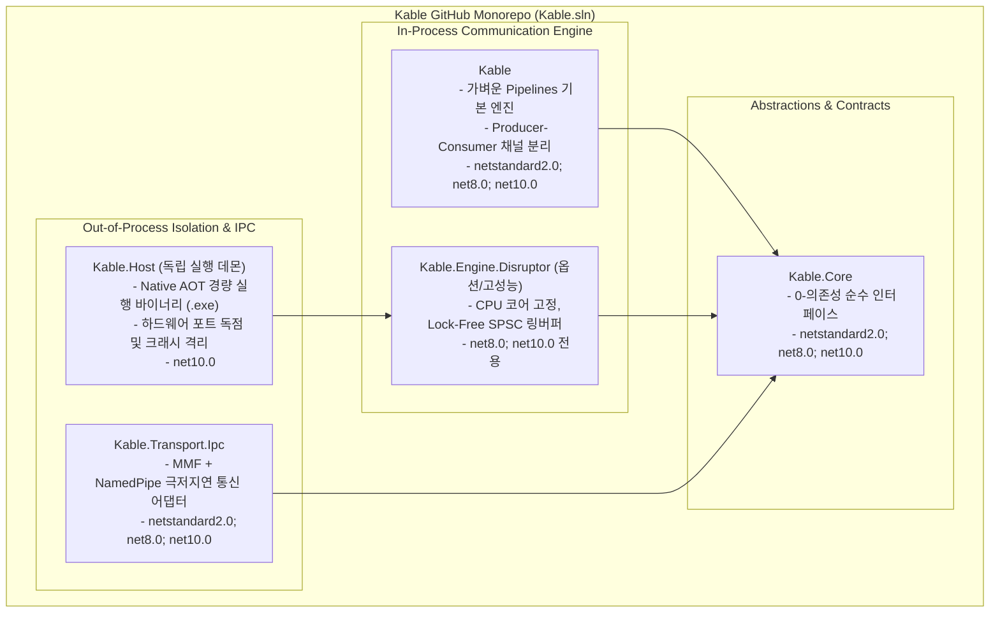

# 🏛️ Kable 진화 및 현실적 구현 결정서 (Decision Framework)

> **문서 상태**: 사용자 승인 완료 (멀티 프로젝트 모노레포 아키텍처 확정)  
> **핵심 결정**: 단일 라이브러리 족쇄를 탈피하고, 현대적 오픈소스 표준인 **모노레포(Monorepo) 멀티 패키지 구조**로 분기  
> **위치**: `d:/Johnny/Kable/docs/검토사항/Plan/`

---

## 1. 아키텍처 대전환 결정 요약

사용자의 핵심 통찰에 따라, **"단일 라이브러리에 억지로 모든 것을 구겨 넣는 타협안"을 완전히 폐기**하고, **단일 GitHub 리포지토리 내에서 명확한 관심사별로 프로젝트를 분기하여 관리하는 모노레포(Monorepo) 구조**로 확장합니다.



---

## 2. GitHub 리포지토리 및 멀티 프로젝트 관리 전략

### Q. GitHub 프로젝트를 여러 개로 쪼개야 하나요?
> **A. 아닙니다. 단일 리포지토리(Monorepo) 내에서 솔루션(`Kable.sln`) 하위 프로젝트로 분기하여 한곳에서 일관되게 관리하는 것이 최선의 글로벌 표준입니다.**
> (ASP.NET Core, gRPC, Orleans, Akka.NET, Serilog 등이 모두 이 구조를 취함)

#### 1) 단일 Git 리포지토리의 절대적 장점
- **원자적 커밋(Atomic Commits)**: 코어 인터페이스(`Kable.Core`)를 바꿀 때 구현체(`Kable`, `Kable.Host`)와 단위 테스트를 한 번의 PR/커밋으로 동기화 검증 가능.
- **CI/CD 통합**: GitHub Actions에서 솔루션 전체(`dotnet test Kable.sln`)를 한 번에 빌드하고 패키징.
- **개별 NuGet 배포**: 단일 리포지토리 안에서 독립적인 NuGet 패키지(`Kable.Core.nupkg`, `Kable.nupkg`, `Kable.Transport.Ipc.nupkg`)가 각각 발행됨.

---

## 3. 솔루션 구성 및 4대 서브 프로젝트 상세 스펙

```
d:/Johnny/Kable/
├── Kable.sln
├── src/
│   ├── Kable.Core/                # [P0] 순수 인터페이스 (IConnectionContext, IProtocolCodec 등)
│   ├── Kable/                     # [P0] 표준 인프로세스 통신 엔진 (Producer-Consumer 분리)
│   ├── Kable.Generators/          # [P0] 로슬린 소스 생성기 (기존 유지)
│   ├── Kable.Transport.Ipc/       # [P1] MMF / NamedPipe 고속 프로세스 간 통신
│   ├── Kable.Engine.Disruptor/    # [P2] 전용 스레드 + 코어 고정 SPSC 링버퍼 엔진
│   └── Kable.Host/                # [P2] Native AOT 하드웨어 격리 데몬 (.exe)
└── tests/
    ├── Kable.Tests/               # 코어 및 표준 엔진 검증
    ├── Kable.Generators.Tests/    # 소스 생성기 검증
    ├── Kable.Ipc.Tests/           # IPC 통신 및 단선 복구 검증
    └── Kable.Benchmarks/          # BenchmarkDotNet Zero-GC 측정
```

### 1) `Kable.Core` (순수 계약 계층)
- **대상 프레임워크**: `netstandard2.0;net8.0;net10.0`
- **의존성**: 순수 0개 (외부 라이브러리 일체 배제).
- **역할**: `IConnectionContext`, `IProtocolCodec<T>`, `IDeviceSession<T>`, `ICommObserver` 등 추상 인터페이스만 보유.

### 2) `Kable` (표준 인프로세스 엔진)
- **대상 프레임워크**: `netstandard2.0;net8.0;net10.0`
- **핵심 개선 (`thread` 해결)**:
  - `ReadLoopAsync`와 `DispatchMessage`를 **`System.Threading.Channels` 기반 Producer-Consumer**로 분리하여 I/O 지터 원천 차단.
  - `StopAsync` 시 `_readLoopTask` 명시적 Graceful Join (2초 타임아웃 방어) 및 고아 태스크 박멸.

### 3) `Kable.Transport.Ipc` (프로세스 간 통신 어댑터)
- **대상 프레임워크**: `netstandard2.0;net8.0;net10.0`
- **핵심 개선 (`process` 해결)**:
  - `MemoryMappedFile` + `NamedPipe`를 `IConnectionContext`로 래핑.
  - 상위 호스트 앱에서는 일반 소켓 쓰듯 동일한 `KableSession` 인터페이스로 원격 데몬과 통신.

### 4) `Kable.Host` (외부 격리 데몬 실행기)
- **대상 프레임워크**: `net10.0` (Native AOT 단일 실행 파일 `.exe`)
- **핵심 개선 (`process` 완벽 정복)**:
  - 하드웨어 시리얼/TCP 포트를 독점 열고, 상위 프로세스와 IPC로만 데이터 교환.
  - USB 분리, 드라이버 크래시가 발생해도 메인 프로그램은 무영향.

---

## 4. 단계별 소스코드 작업 로드맵 (Action Plan)

| 단계 | 작업 목표 | 세부 구현 내용 |
| :--- | :--- | :--- |
| **Phase 1** | **Kable 표준 엔진 스레드 격리 & 수명주기 보강** | - `src/Kable/Engine/KableSession.cs`: `StopAsync` Graceful Join 보강<br>- `KableSession.cs`: Channel 기반 I/O-디스패치 Producer-Consumer 분리<br>- `tests/Kable.Tests`: 수명주기 및 동시성 검증 테스트 추가 |
| **Phase 2** | **Kable.Core 인터페이스 독립 프로젝트 분리** | - `src/Kable.Core/` 프로젝트 신설 및 솔루션 등록<br>- 인터페이스 분리를 통한 순수 0-의존성 계약 계층 확립 |
| **Phase 3** | **IPC 및 Out-of-Process 격리 계층 구축** | - `src/Kable.Transport.Ipc/`: MMF / NamedPipe 어댑터 구현<br>- `src/Kable.Host/`: Native AOT 경량 하드웨어 데몬 프로젝트 구현 |
| **Phase 4** | **종합 검증 및 CI/CD 멀티 패키징 정비** | - 전체 프로젝트 빌드/테스트 통과 및 GitHub Actions 멀티 패키징 구성 |
