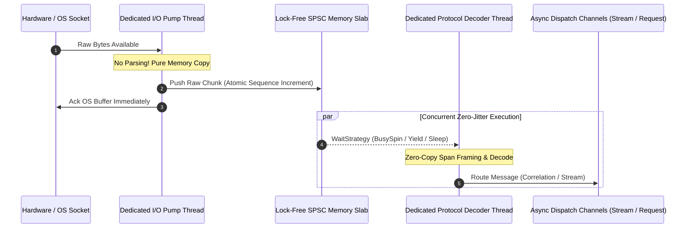

# 02. 스레딩 모델 & 0-GC 디스패치 파이프라인 (Threading & Disruptor)

> **문서 상태**: 동시성 및 I/O 파이프라인 심층 기술 명세서  
> **상위 문서**: [INDEX.md](file:///d:/Johnny/Kable/docs/검토사항/Plan/INDEX.md)

---

## 1. 기존 KableSession의 구조적 병목 지점 분석

현재 `KableSession<TMessage>.cs`의 수신 루프(`ReadLoopAsync`)는 다음과 같이 동작합니다:

```csharp
// [기존 코드의 문제점]
while (!_sessionCts.IsCancellationRequested)
{
    var result = await reader.ReadAsync(_sessionCts.Token).ConfigureAwait(false);
    var buffer = result.Buffer;

    while (_codec.TryDecode(ref buffer, out var message))
    {
        DispatchMessage(message); // <- I/O 루프 스레드에서 직접 동기 실행!
    }

    reader.AdvanceTo(buffer.Start, buffer.End);
    if (result.IsCompleted || result.IsCanceled) break;
}
```

### 왜 이것이 문제가 되는가?
1. **I/O 배압(Backpressure) 역전 현상**:
   - `DispatchMessage` 내부에서 `_incomingStream.Writer.TryWrite(message)`를 부르고, `_observer?.OnPacketTrace(...)`를 부릅니다.
   - 만약 디코딩된 메시지가 수백 개로 폭주하거나, 코덱 내부에서 암호화/체크섬 검사/문자열 변환 등으로 인해 10ms의 시간이 소요된다면, 그 10ms 동안 소켓/시리얼 하드웨어로부터 데이터를 읽는 `reader.ReadAsync`가 지연됩니다.
   - 결과적으로 OS 커널의 수신 버퍼가 가득 차서 **TCP 윈도우 크기 감소** 또는 **RS-232C 하드웨어 버퍼 오버런(Buffer Overrun Error)**이 발생합니다.
2. **비대칭 스레드 컨텍스트 전파**:
   - `TrySetResult`를 호출할 때 후속 작업이 비동기로 분기되더라도, 디스패치 루프 자체가 지연되어 다음 프레임 디코딩이 밀립니다.

---

## 2. 해결책: Lock-Free SPSC Disruptor 파이프라인

I/O 수신 계층과 비즈니스 디코딩 계층 사이에 **LMAX Disruptor 스타일의 락-프리 링버퍼(RingBuffer)**를 도입합니다.



### 1) 구조체 슬랩(Pre-Allocated Memory Slab)
```csharp
[StructLayout(LayoutKind.Sequential, Pack = 64)] // 캐시 라인(64바이트) 패딩으로 False Sharing 방지
public struct RawPacketSlot
{
    public long Sequence;
    public int Length;
    public fixed byte Data[4096]; // 정적 4KB 인라인 고정 버퍼 (Zero GC Alloc)
}
```

### 2) SPSC (Single Producer Single Consumer) 원칙
- **생산자(Producer)**: 오직 `Dedicated I/O Pump` 1개 스레드만 슬롯에 씁니다.
- **소비자(Consumer)**: 오직 `Dedicated Protocol Decoder` 1개 스레드만 슬롯을 읽습니다.
- **결과**: `lock`이나 `SemaphoreSlim`이 전혀 필요 없으며, CPU `Interlocked` 연산과 메모리 배리어(`Thread.MemoryBarrier`)만으로 나노초 단위 동기화가 가능합니다.

---

## 3. Graceful Shutdown & 고아 태스크(Orphan Task) 완전 방어

`thread` 문서 39~41번 지적사항("스레드 생명주기 관리의 번거로움")을 해결하기 위한 결정론적 종료 규약:

```csharp
public async ValueTask StopAsync(CancellationToken ct = default)
{
    // 1. 취소 토큰 브로드캐스트
    _sessionCts.Cancel();

    // 2. 물리 Transport 레벨 Abort 전파
    _context?.Abort("StopAsync requested by application");

    // 3. I/O 펌프 태스크와 디코더 태스크의 명시적 Join (타임아웃 2초 방어)
    if (_ioPumpTask != null)
    {
        var timeoutTask = Task.Delay(2000, ct);
        var completed = await Task.WhenAny(_ioPumpTask, timeoutTask).ConfigureAwait(false);
        if (completed == timeoutTask)
        {
            // 경고 로깅 및 강제 회수
            _observer?.OnLog(LogLevel.Warning, "I/O Pump Task did not terminate gracefully within 2000ms.");
        }
    }

    // 4. 대기 중인 모든 Pending Request에 대해 Fail-Fast 예외 주입
    OnConnectionClosed();

    // 5. 리소스 명시적 해제
    if (_context != null)
    {
        await _context.DisposeAsync().ConfigureAwait(false);
    }
}
```
