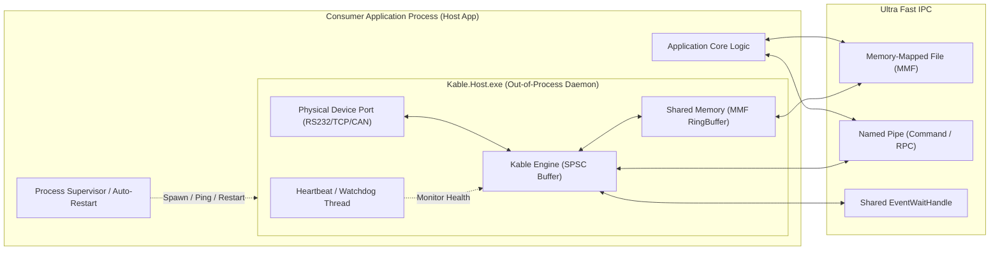

# 03. 프로세스 격리 호스트 & 무중단 복원력 (Out-of-Process Isolation)

> **문서 상태**: 다중 프로세스 및 장애 격리(Fault Domain Isolation) 설계서  
> **상위 문서**: [INDEX.md](file:///d:/Johnny/Kable/docs/검토사항/Plan/INDEX.md)

---

## 1. 단일 프로세스 모놀리스의 위험성 (`process` 문서의 핵심 비판)

하드웨어 통신 소프트웨어 크래시의 80% 이상은 다음 원인으로 발생합니다:
1. **USB-to-Serial(FTDI, Prolific 등) 가상 드라이버의 네이티브 크래시 / 커널 I/O 행(Hang)**:
   - 케이블이 헐거워져 물리적으로 분리될 때, Windows 커널 레벨 드라이버가 I/O 요청을 무한 블로킹하거나 Access Violation을 발생시킴.
   - 단일 프로세스 구조에서는 상위 호스트 프로그램(UI, 비즈니스 로직, 서버) 전체가 즉각 멈추거나 강제 종료됨.
2. **단일 프로세스 메모리 오염**:
   - 네이티브 C/C++ 장비 통신 SDK/DLL을 P/Invoke 할 때 메모리 누수나 힙 손상이 호스트 애플리케이션 전체로 전파됨.

---

## 2. Kable Out-of-Process 아키텍처: `Kable.Host`

Kable은 단일 프로세스 인베디드 라이브러리 모드뿐만 아니라, **완전 프로세스 격리 모드(Process Isolation Mode)**를 1급 시민으로 지원하도록 설계합니다.

---

## 3. 핵심 구성 요소 설계

### 1) Kable.Host (경량 하드웨어 통신 데몬)
- `.NET 10 Native AOT`로 컴파일되어 5MB 미만의 초경량 단일 실행 파일(`.exe`)로 빌드.
- 장비와의 물리 I/O 및 1차 패킷 프레이밍만 전담.
- 상위 소비자 애플리케이션의 복잡한 로직과 물리적으로 단절되어 크래시 도메인 완벽 분리.

### 2) Shared Memory (MMF) + EventWaitHandle 기반 극저지연 IPC
- TCP 소켓 IPC 대비 CPU 사용량 90% 절감, 지연시간 0.05ms(50µs) 이하 달성.
- 원형 공유 메모리 링버퍼(Circular Shared Memory)에 프레이밍 완료된 패킷을 직접 기록.
- `EventWaitHandle`로 대기 중인 호스트 애플리케이션에 커널 시그널 즉각 전달.

### 3) Supervisor & Auto-Healing (자동 자가 치유 루틴)
- `process` 문서의 "우아한 종료 및 좀비 프로세스 방지" 규약 적용:
  - 부모 프로세스(Host Application)가 비정상 종료되면 Windows Job Object 또는 상호 프로세스 하트비트를 통해 `Kable.Host`가 500ms 이내에 스스로 클린 종료(고아 프로세스 방지).
  - 반대로 `Kable.Host`가 크래시될 경우, 호스트 앱의 `HostSupervisor`가 100ms 이내에 즉각 데몬을 재기동하고 기존 통신 세션을 무중단 복원(State Recovery).
