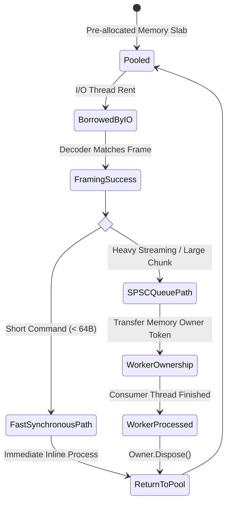

# 04. 메모리 수명주기 & Zero-Copy 소유권 (Memory Safety)

> **문서 상태**: 제로 가비지(0-GC) 및 메모리 소유권 안전성 명세서  
> **상위 문서**: [INDEX.md](file:///d:/Johnny/Kable/docs/검토사항/Plan/INDEX.md)

---

## 1. Zero-Allocation의 가장 위험한 함정: UAF (Use-After-Free)

고성능 통신 엔진에서 메모리 할당(Allocations)을 줄이기 위해 `ReadOnlySpan<byte>`와 `ReadOnlySequence<byte>`를 광범위하게 사용합니다.  
그러나 **비동기(`async/await`) 환경과 메모리 풀(`ArrayPool`, `PipeReader`)이 결합될 때 가장 빈번하게 발생하는 치명적 버그**는 다음과 같습니다:

```
[I/O 루프] PipeReader.ReadAsync() -> 버퍼 획득 -> 코덱 디코딩 시도
-> [비동기 분기] Task.Run 또는 Channel.Writer.TryWrite(메시지)
-> [I/O 루프] reader.AdvanceTo() 호출 -> 메모리 풀로 버퍼 반환(Return)!
-> [비동기 워커] 뒤늦게 반환된 버퍼 메모리를 읽음 -> 메모리 오염(Corruption) 또는 UAF!
```

이것이 바로 `docs/검토사항/thread`의 2번("동기화 버그 회피로 인해 단일 스레드로 회귀하는 문제")을 초래하는 근본 원인입니다. 멀티스레드로 쪼개려면 **메모리의 명확한 소유권(Ownership)과 수명주기(Lifecycle)** 모델이 필수적입니다.

---

## 2. 해결책: 명시적 메모리 소유권(Explicit Ownership) 모델

Kable은 Rust의 소유권(Ownership) 및 빌림(Borrowing) 개념을 C# 런타임 상에서 `IMemoryOwner<byte>` 패턴으로 구현합니다.



### 1) 경량 프레임 복사 vs 대용량 제로카피 분기 정책
- **소형 제로카피 (64바이트 이하 - 명령어 응답, 상태 코드)**:
  - C# `ref struct`와 `stackalloc` 기반 복사 비용이 메모리 풀 핸들 관리 오버헤드보다 훨씬 저렴합니다.
  - CPU L1 캐시 내부에서 1나노초 이내에 스택 복사 후 파이프 버퍼를 즉시 해제.
- **대형 패킷 / 스트리밍 (64바이트 이상 - 스펙트럼 데이터, 대용량 바이너리)**:
  - `IMemoryOwner<byte>` 기반의 청크 소유권을 소비자(Worker)에게 전달.
  - 소비자가 처리를 완료할 때까지 버퍼 슬랩이 보존되며, 처리가 끝난 후 `Dispose()`를 통해 슬랩 링버퍼로 즉시 반환.

---

## 3. GC 컬렉션 제로 증명 검증 규약

단순히 "Zero-GC를 지향한다"는 주장에 그치지 않고, CI/CD 테스트 파이프라인에서 하드웨어 스트레스 테스트 시 GC 할당량을 엄격히 검증합니다:

```csharp
[Fact]
public async Task HighThroughputStreaming_ShouldProduceZeroGCAllocations()
{
    // Arrange
    var session = CreateConfiguredSession();
    const int messageCount = 100_000;

    // Warm-up (JIT 및 풀 예열)
    await WarmUpAsync(session);

    var startGen0 = GC.CollectionCount(0);
    var startGen1 = GC.CollectionCount(1);
    var startGen2 = GC.CollectionCount(2);
    var startAllocatedBytes = GC.GetAllocatedBytesForCurrentThread();

    // Act
    await session.SimulateBurstTrafficAsync(messageCount);

    // Assert
    var endAllocatedBytes = GC.GetAllocatedBytesForCurrentThread();
    var deltaAlloc = endAllocatedBytes - startAllocatedBytes;

    Assert.Equal(0, GC.CollectionCount(0) - startGen0);
    Assert.Equal(0, GC.CollectionCount(1) - startGen1);
    Assert.Equal(0, GC.CollectionCount(2) - startGen2);
    Assert.True(deltaAlloc < 1024, $"메모리 할당 누수 감지: {deltaAlloc} bytes");
}
```
