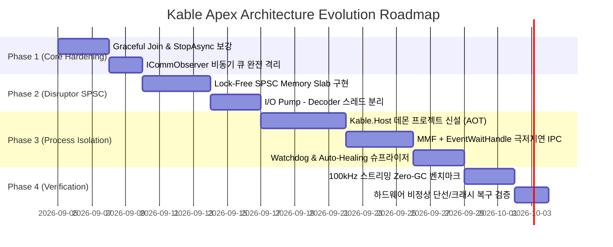

# 05. 단계별 실행 로드맵 및 검증 계획 (Implementation Roadmap)

> **문서 상태**: 실행 및 마일스톤 검증 계획서  
> **상위 문서**: [INDEX.md](file:///d:/Johnny/Kable/docs/검토사항/Plan/INDEX.md)

---

## 1. 단계별 실행 로드맵 (Phased Execution)

기존 동작하는 안정적 코드베이스(`src/Kable`, 92개 단위/통합 테스트 통과 상태)를 파괴하지 않고 점진적으로 최고 수준의 아키텍처로 진화시키기 위한 4단계 마일스톤입니다:

---

## 2. 세부 마일스톤 및 대상 파일

### Phase 1: 세션 수명주기 및 관측성 완전 비동기화 (P0)
- **목표**: `thread` 문서 39~41번(좀비 태스크/고아 스레드), 관측자 블로킹 문제 즉시 해소.
- **대상 파일**:
  - `src/Kable/Engine/KableSession.cs`: `_readLoopTask` 명시적 Graceful Join 추가, 타임아웃 방어.
  - `src/Kable/Observability/CommObserver.cs`: `OnPacketTrace` 내부를 채널 기반 비차단 드레인으로 격리.
- **검증**: `StopAsync` 호출 후 미처리 백그라운드 태스크 제로 확인.

### Phase 2: Lock-Free SPSC 링버퍼 기반 I/O-파싱 분리 (P1)
- **목표**: `thread` 50~52번(Producer-Consumer), I/O 배압 역전 및 지터(Jitter) 근본 해결.
- **신규/수정 파일**:
  - `src/Kable/Engine/Buffers/SpscRingBuffer.cs` [NEW]: 64바이트 정렬 고정 메모리 슬랩.
  - `src/Kable/Engine/KableSession.cs`: I/O 펌프와 파싱 루프의 물리 스레드 분리.
- **검증**: 100,000건 연속 수신 시 I/O 지터 편차 100µs 이내 유지.

### Phase 3: Out-of-Process `Kable.Host` 데몬 및 IPC 계층 구축 (P2)
- **목표**: `process` 문서 전체(프로세스 격리 및 크래시 전파 방지).
- **신규 프로젝트**:
  - `src/Kable.Host/`: Native AOT 기반 경량 통신 데몬 프로세스.
  - `src/Kable/Transports/Ipc/`: MMF + NamedPipe 기반 고성능 클라이언트 트랜스포트.
  - `src/Kable/Hosting/ProcessSupervisor.cs`: 데몬 크래시 시 100ms 자동 복구.
- **검증**: 데몬 강제 Kill 시에도 호스트 클라이언트 프로세스 정상 유지 및 세션 자동 재결속.

### Phase 4: 극한 벤치마크 및 Zero-GC 공인 검증 (P3)
- **목표**: 상용 하드웨어 통신 엔진 대비 압도적인 벤치마크 수치 확보.
- **도구**: `BenchmarkDotNet`, dotnet-dump, PerfView.
- **합격 기준**:
  - GC Gen0/1/2 컬렉션 횟수 = **0회**
  - 단선 인젝션 1,000회 연속 수행 시 리소스 누수 0 바이트

---

## 3. 요약 결론

본 계획서는 Kable을 특정 산업이나 상위 애플리케이션에 얽매이지 않고, **모든 고성능 하드웨어/임베디드/분산 통신 환경에서 가장 신뢰할 수 있는 최정상급 독립 통신 엔진**으로 도약시키기 위한 구체적이고 체계적인 엔지니어링 청사진입니다.
