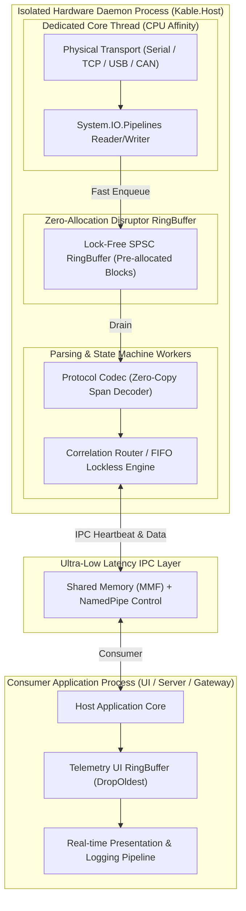

# 🏛️ Kable Architectural Vision & Evolution Plan

> **문서 상태**: 독립 범용 고성능 하드웨어 통신 엔진을 위한 아키텍처 비전 및 심층 개선 설계서  
> **작성 기준**: `docs/검토사항/thread`, `docs/검토사항/process` 분석 (순수 하드웨어 통신/동시성/분산 관점)  
> **위치**: `d:/Johnny/Kable/docs/검토사항/Plan/`

---

## 1. 개요 및 패러다임 전환

`docs/검토사항`의 두 문서는 AI와 일반적인 현대 소프트웨어 개발자들이 흔히 빠지는 두 가지 치명적 함정을 지적합니다:
1. **스레드(Thread) 함정**: `async/await`를 멀티스레드의 만능 대체재로 착각하여, 단일 이벤트 루프 스레드에서 무거운 디코딩/파싱/디스패치를 수행해 I/O 지터(Jitter)와 블로킹을 유발하는 문제.
2. **프로세스(Process) 함정**: 모든 장비 드라이버와 통신 로직을 단일 사용자 애플리케이션 프로세스에 밀어 넣어, USB/시리얼 드라이버 오류나 OS 레벨 I/O 행(Hang)이 전체 프로그램을 크래시시키는 문제.

세계 최고 수준의 통신 엔진(예: LMAX Disruptor, Envoy, Bedrock, ROS2 Micro-XRCE) 관점에서, 특정 상위 도메인에 종속되지 않고 **"물리 I/O의 나노초 단위 결정론성"**과 **"프로세스 장애 시 시스템 무중단 복원력"**을 동시에 달성하는 범용 아키텍처를 수립합니다.

---

## 2. 세부 관심사별 설계 문서 인덱스

본 `Plan` 디렉터리는 엔지니어링 오해와 개념 혼선을 방지하기 위해 관심사를 명확히 분리하여 5개의 핵심 문서로 구성됩니다:

| 문서 링크 | 핵심 관심사 (Core Concern) | 해결하는 본질적 문제 |
| :--- | :--- | :--- |
| [01_PARADIGM_CRITIQUE.md](file:///d:/Johnny/Kable/docs/검토사항/Plan/01_PARADIGM_CRITIQUE.md) | **패러다임 비판 및 최고 엔지니어의 시각** | 기존 권고안의 한계 지적, Go/Rust/C++ 고성능 엔진 관점에서의 진정한 솔루션 |
| [02_THREADING_AND_DISRUPTOR.md](file:///d:/Johnny/Kable/docs/검토사항/Plan/02_THREADING_AND_DISRUPTOR.md) | **스레딩 모델 & 0-GC 디스패치 파이프라인** | ThreadPool 스케줄링 오버헤드 극복, LMAX Disruptor 링버퍼 기반 I/O-파싱 격리 |
| [03_OUT_OF_PROCESS_HOST.md](file:///d:/Johnny/Kable/docs/검토사항/Plan/03_OUT_OF_PROCESS_HOST.md) | **프로세스 격리 호스트 & 무중단 복원력** | Out-of-Process Device Daemon, Shared Memory(MMF)/IPC, Watchdog 자동 복구 |
| [04_ZERO_ALLOC_MEMORY_SAFETY.md](file:///d:/Johnny/Kable/docs/검토사항/Plan/04_ZERO_ALLOC_MEMORY_SAFETY.md) | **메모리 수명주기 & Zero-Copy 소유권** | ReadOnlySequence 수명주기 안전성, ArrayPool 누수 방지, Unmanaged 드라이버 크래시 방어 |
| [05_IMPLEMENTATION_ROADMAP.md](file:///d:/Johnny/Kable/docs/검토사항/Plan/05_IMPLEMENTATION_ROADMAP.md) | **단계별 실행 로드맵 및 검증 계획** | Phase 1~4 단계적 전환 계획, 단위/장애 주입 벤치마크 검증 지표 |

---

## 3. 핵심 아키텍처 토폴로지 (Top-Level Topology)

---

## 4. 기대 효과
1. **극단적 I/O 결정론성(Determinism)**: GC 일시 정지(Stop-the-World)나 스레드 풀 기아 상태에서도 물리 하드웨어 수신 버퍼 오버플로우가 100% 방지됩니다.
2. **완벽한 오류 격리(Fault Domain Isolation)**: 하드웨어 드라이버 BSOD 직전의 네이티브 크래시나 무한 블로킹이 발생해도 호스트 애플리케이션 전체는 안전하며, 통신 데몬 프로세스만 100ms 내에 핫 리스타트됩니다.
3. **측정 가능한 제로 가비지(True 0-GC)**: 초당 수만 건의 패킷 수신 환경에서도 Gen0/Gen1/Gen2 할당이 발생하지 않습니다.
